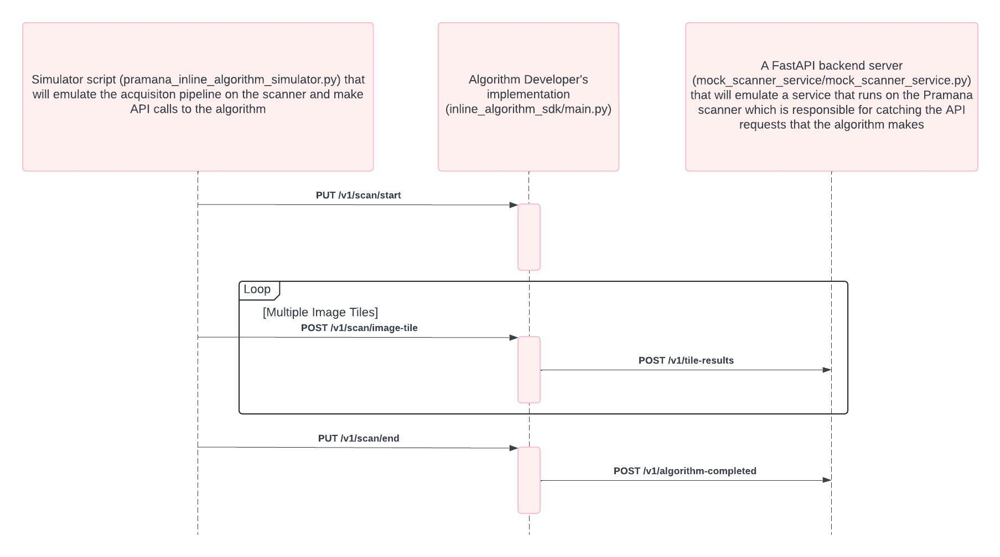

# Pramana Inline Algorithm Simulator

This document provides a guide on how to simulate the entire Inline Algorithm Pipeline that will run on a Pramana scanner.

## Introduction
Pramana has a standardized API format for communicating between the Pramana scanning system and any image analysis algorithm module. For ease of deployment the algorithm module is recommended to be encapsulated and deployed as a Docker container. This API simulator includes the state changes of the scanning process from the start to the end and provides access to the image data inline during the scanning process.

## Folder Structure
    .
    ├── mock_scanner_service
    │   ├── mock_scanner_service.py
    │   ├── models_scanner.py
    │   └── scanner_service_helpers.py
    ├── pramana_scanning_process_simulator.py
    ├── config.ini
    ├── requirements-for-simulator.txt
    ├── setup.sh
    ├── sequence_diagram.jpeg
    └── README.md
## File Breakdown
 1. ```pramana_scanning_process_simulator.py```
  This is the  simulator script to make the needed API calls. This script reads the sample ```ome.tiff``` or a ```.dcm``` file from the ```data/``` directory, breaks it down to ```.bmp``` files and saves it in a subdirectory inside the ```data/``` directory. This file will mock the image acquisition process of the Pramana Scanner.

2. ```mock_scanner_service/mock_scanner_service.py```
This is a ```FastAPI``` backend server that runs on the ```PORT 8001```. This service will mock the Pramana Scanner and receive the API calls made by your algorithm. It uses the ```models_scanner.py``` and ```scanner_service_helpers.py``` files to run.

3. ```config.ini```
 This config file is where all the constant parameters are defined. These should be modified as
 needed for your testing.
    - ```INPUT_FILE_NAME``` : This is the name for the input file (either ```ome.tiff``` or ```dcm``` file).
    - ```BASE_PATH``` : This is the absolute base path of the repository  (**you will need to replace this with the base path respective to your machine**).
    - ```ALGORITHM_ID``` : This is the algorithm id.
    - ```SLIDE_NAME``` : This is the slide name.
    - ```STAIN_NAME``` : This is the stain name.
    - ```ORGAN_NAME``` : This is the organ name.
4. ```setup.sh```
This setup file creates two subdirectories called ```data``` and ```output``` and downloads an ```ome.tiff``` in the ```data``` subdirectory.

## Prerequisite 
- Python3.10 or higher.
- `wget`

## Steps to install dependencies
- ```cd``` into the ```pramana_api_call_simulator``` folder
- Execute it using the command: ```./setup.sh```  
- Create a virtual environment using the command: ```python3 -m venv venv```
- Activate the virtual environment using the command: ```source venv/bin/activate```
- Install the dependencies using the command: ```pip install -r requirements-for-simulator.txt```

## Run the Mock Scanner Service
Enter the command: ```python mock_scanner_service/mock_scanner_service.py```

## Run the simulator script to make the API calls
- Run this in a new terminal
- One can either run the script in interactive mode which asks for the user to trigger the pipeline step by step or in non-interactive mode which will run the entire script end to end without any user interaction required. Note: With the interactive mode you can skip the function which extracts the tiles from the ome.tiff you have already ran the script before to save time.
- To run the python script in interactive mode and if the algorithm api service is running on localhost:  ```python pramana_scanning_process_simulator.py -i```. If the algorithm api service is running inside a docker container run: ```python pramana_scanning_process_simulator.py -i -d```
- To run the python script in non-interactive mode if the algorithm api service is running on localhost: ```python pramana_scanning_process_simulator.py```. If the algorithm api service is running inside a docker container run: ```python pramana_scanning_process_simulator.py -d```

----
# Sequence Diagram of the API calls

